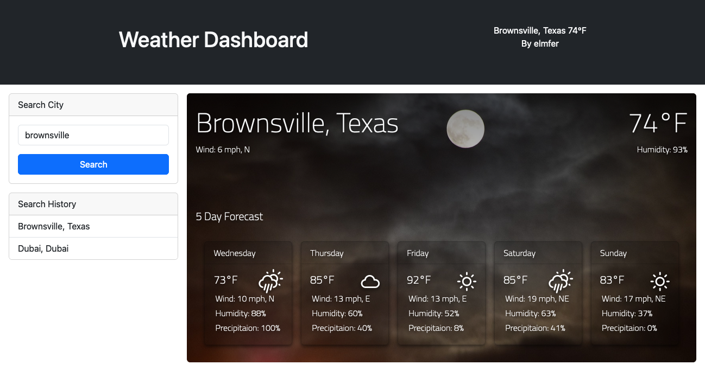

# weather-dashboard
Get your weather in your city or wherever remote in a nice clean interface!

Get started by clicking on this link: [https://elmfer.github.io/weather-dashboard/](https://elmfer.github.io/weather-dashboard/)

### Screenshot

### Features
* Search a city by it's name
* Display picture closest looking to weather
* 5 Day Forecast
* Search History

### What I Learned
* Javascript Promises
* How To Third Party Server-Side APIs
* More CSS magic such as `backdrop-filter` for the frosted glass effect
* Javascript fetch API

### Credits
* Weather Icons: [https://erikflowers.github.io/weather-icons/](https://erikflowers.github.io/weather-icons/)
* Background Images from pixabay.
* Google Fonts for the dashboard.